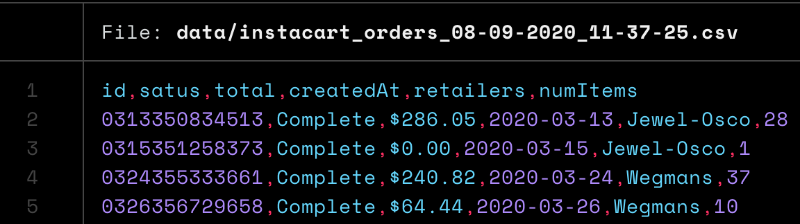
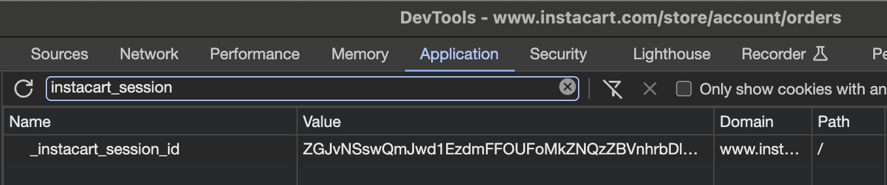

# Instacart CSV Export

Export your order history from Instacart into a CSV. I know, exciting stuff!

If you're like me and use text based accounting to track your expenses, having a CSV to get insight into how you much
has been spent on various categories make it easy to import.

## CSV Fields

| Field     | Description                             |
| --------- | --------------------------------------- |
| id        | The order ID                            |
| status    | The order status                        |
| total     | The order total                         |
| createdAt | The order creation date (YYYY-MM-DD)    |
| retailers | A pipe delimited list of retailer names |
| numItems  | The number of items in the order        |

## Sample output



## Setup

This tool was created quick and dirty. It's rough, really rough. It works for my purposes, but your mileage may vary.

You'll need to log into the Instacart web app and get your session token. The token is in the `_instacart_session` cookie.



Install the binary with the following

```shell
go get -u github.com/grocky/go-instacart-export/...
```

## Usage

Now you can invoke this binary and it will fetch all of your orders and place them into a CSV.

```shell
INSTACART_SESSION_TOKEN=<your token> instacart-export
```

## License

[MIT © Rocky Gray](LICENSE)
